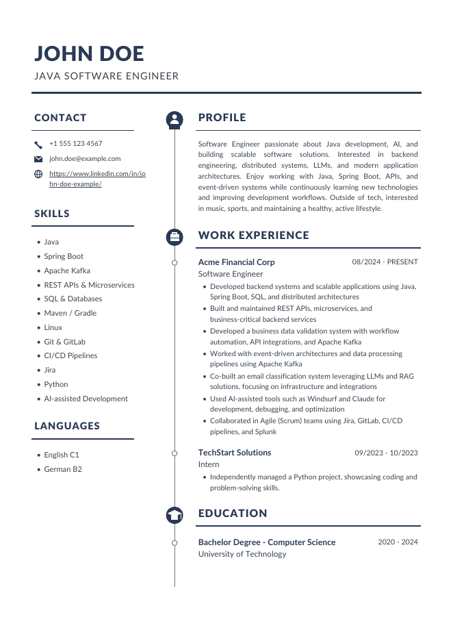

# cv-agent

Generator CV dopasowanego pod konkretną ofertę pracy. Lokalny LLM (Ollama) czyta wymagania firmy i profil kandydata, zwraca ustrukturyzowane dane (Pydantic), recenzent AI iteracyjnie ocenia i poprawia dopasowanie, a renderer (fpdf2) składa z tego profesjonalny, dwukolumnowy PDF.



## Jak to działa

```
documents/company_requirements.txt ─┐
                                    ├─> generator (Ollama, JSON) ─> recenzent AI ─> poprawa ─┐
documents/user_profile.txt ────────┘         ▲                    (match_score,             │
                                             └────────────────────brakujące keywordy) <─────┘
                                                     pętla do wyniku >= 90 lub N iteracji
                                                                  │
                                                                  ▼
                                                     CVData (Pydantic) ─> fpdf2 ─> output/cv.pdf
                                                                  └─> output/cv.json (do ręcznych poprawek)
```

Model dostaje schemat JSON wygenerowany z modeli Pydantic (`format=CVData.model_json_schema()`), więc odpowiedź jest zawsze poprawnym, walidowanym JSON-em — bez parsowania luźnego tekstu. Recenzent działa jak ATS: liczy dopasowanie 0-100, wskazuje brakujące słowa kluczowe (tylko te pokryte profilem kandydata) i słabe punkty, a krok poprawy wprowadza zmiany bez wymyślania faktów.

Dodatkowe zabezpieczenia pętli recenzji:

- **keep-best** — każda wersja CV jest oceniana, a do PDF-a trafia ta z najwyższym wynikiem (poprawka, która pogorszyła CV, nie przebije lepszej wersji),
- **blokada faktów** — po każdej poprawie kod (nie LLM) przywraca twarde dane: imię, kontakt, edukację, nazwy firm, stanowiska i daty; doświadczenie wymyślone przez model jest odrzucane,
- **raport recenzji** — pełna historia iteracji (wyniki, brakujące słowa kluczowe, sugestie) trafia do `output/cv_review.md`.

## Wymagania

- Python 3.10+
- [Ollama](https://ollama.com) z pobranym modelem, np. `ollama pull qwen2.5:7b`

## Instalacja

```bash
git clone https://github.com/MichalPuc/cv-agent.git
cd cv-agent
python -m venv .venv
.venv\Scripts\activate        # Windows (Linux/macOS: source .venv/bin/activate)
pip install -r requirements.txt
```

Przygotuj dane wejściowe (folder `documents/` jest ignorowany przez git — nie trafi do repo):

- `documents/company_requirements.txt` — treść oferty / wymagania firmy
- `documents/user_profile.txt` — Twój pełny profil: doświadczenie, projekty, umiejętności, kontakt

## Użycie

```bash
python main.py                                        # generacja + 1 iteracja recenzji
python main.py -r 3                                   # do 3 iteracji recenzji i poprawy
python main.py -r 0                                   # bez recenzenta
python main.py -c documents/google.txt -o output/cv_google.pdf
python main.py -m llama3.1:8b                         # inny model Ollama
python main.py --review-model qwen2.5:14b             # mocniejszy model tylko do recenzji
python main.py --from-json output/cv.json             # popraw JSON ręcznie i przerenderuj bez LLM
```

Obok PDF-a zapisywany jest plik `.json` z danymi CV — możesz go ręcznie doszlifować i wyrenderować ponownie w sekundę (`--from-json`).

## Struktura projektu

| Plik | Rola |
|---|---|
| `main.py` | CLI (argparse), orkiestracja i pętla recenzji |
| `models.py` | Schematy danych: CVData, Review (Pydantic) |
| `generator.py` | Generacja CV (Ollama, structured outputs) |
| `reviewer.py` | Recenzja i poprawa CV |
| `llm.py` | Wspólna warstwa wywołań Ollama |
| `renderer.py` | Render PDF (fpdf2) — layout dwukolumnowy |
| `loader.py` | Wczytywanie plików i szablonów promptów |
| `prompts/` | Szablony promptów: generacja, recenzja, poprawa |
| `examples/sample_cv.json` | Przykładowe dane do testu renderera |
| `fonts/` | Fonty Lato używane w PDF |

## Licencja fontów

Fonty Lato — [SIL Open Font License](https://www.latofonts.com/lato-free-fonts/).
